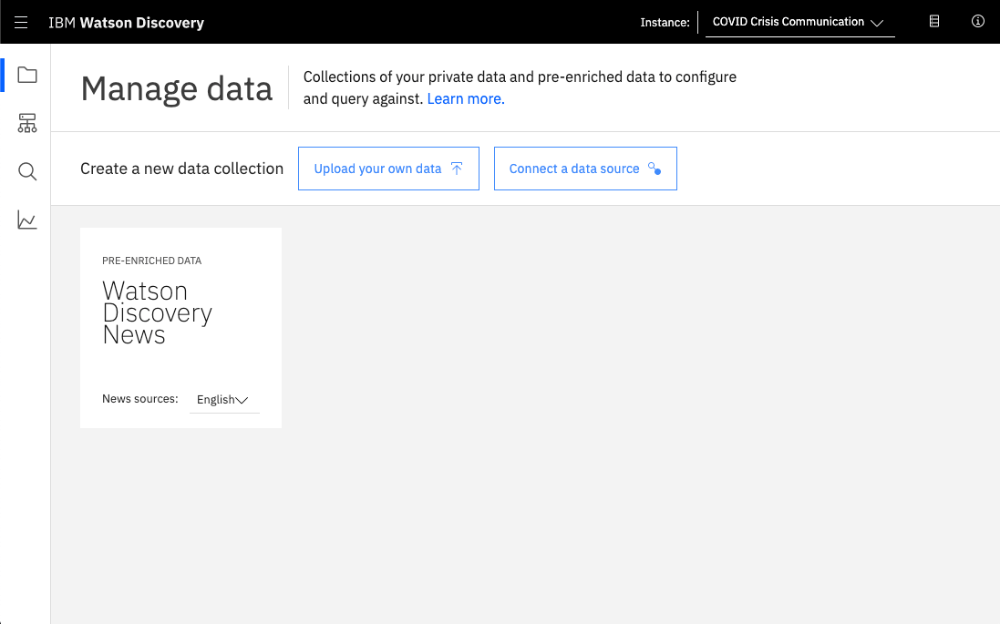
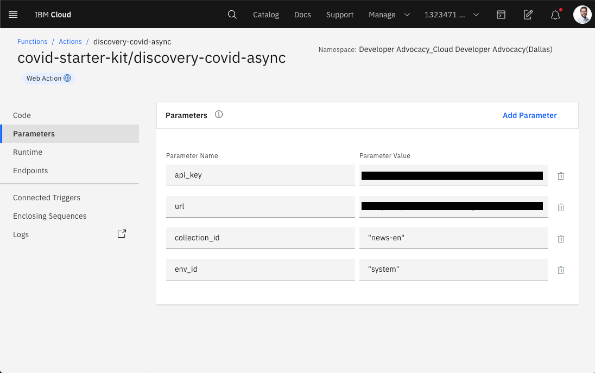
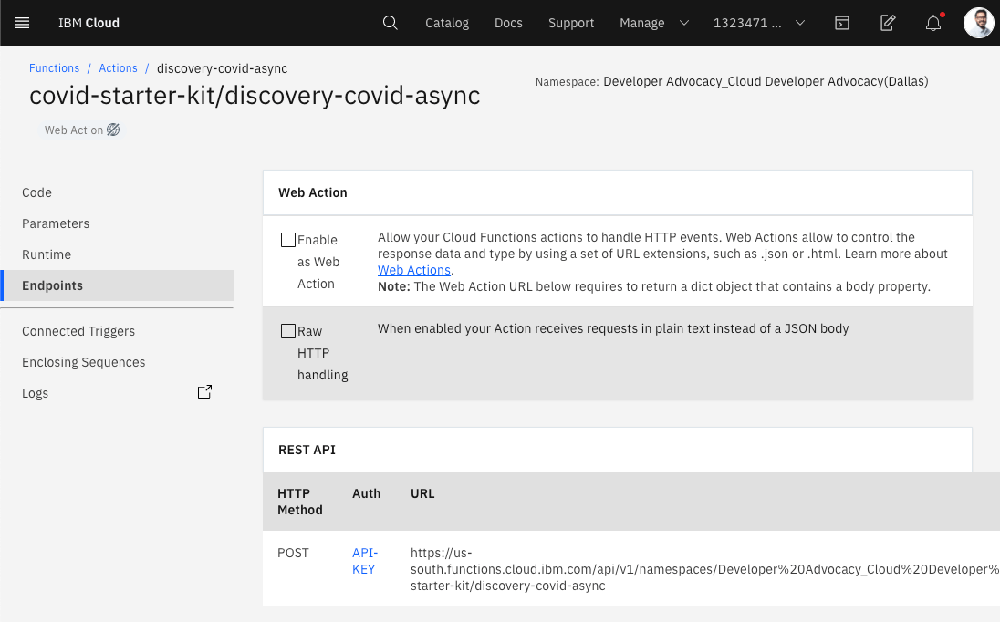
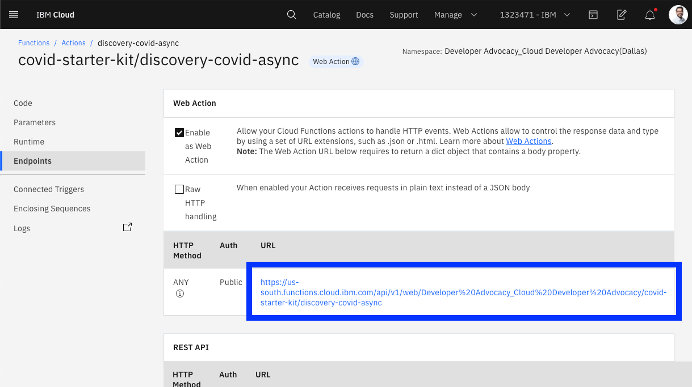
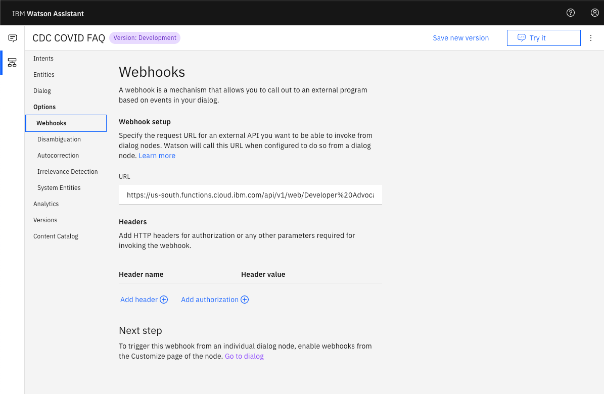
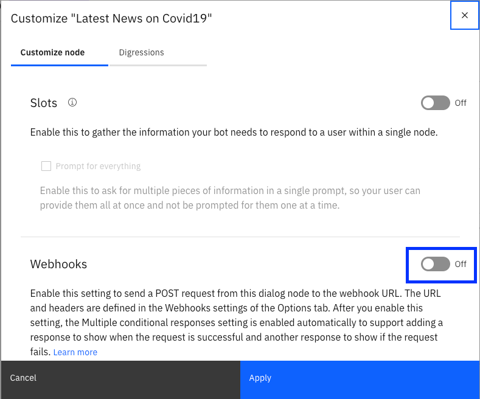
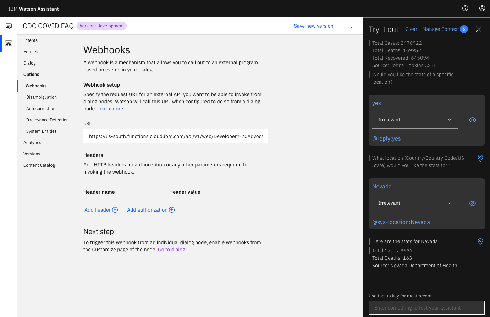

# Create a crisis communication chatbot and connect it to news and COVID-19 data sources

In times of crisis, chatbots can help people quickly find answers they need to critical questions. In the case of a pandemic like COVID-19, people might be trying to find basic information about testing, symptoms, community response, and other resources.

This tutorial shows you how to create a crisis communication chatbot using IBM® Watson™ Assistant and how to add webhooks to Watson Assistant to query for dynamic data using Watson Discovery and COVID-19 APIs.

## Learning objectives

In this tutorial, you will:

- Provision an instance of Watson Assistant
- Add a dialog skill to your Watson Assistant instance
- Connect your Watson Assistant with Watson Discovery
- Create Cloud Functions
- Integrate data sources via a Watson Assistant webhook


## Prerequisite

- Register for an [IBM Cloud](https://ibm.biz/BdqfRf) account.
- [GitHub](https://github.com/) account for code repository
- Download the code from this GitHub [repository](https://github.com/IraAngeles-IBM/Solution-Starter-Kit-Communication-2020-ASEAN)

## Estimated time

This tutorial takes about 40 minutes to complete.

# Create your chatbot by setting up a Watson Assistant instance

We show you how to create a chatbot using Watson Assistant, a tool that enables you to build conversational interfaces into any application, device, or channel.

**Step 1.** From the [IBM Cloud catalog](https://cloud.ibm.com/catalog/services/watson-assistant), provision an an instance of **Watson Assistant**.
  
  

**Step 2.**  Launch the Watson Assistant service.

**Step 3.** Click **Create assistant** and follow [these detailed instructions](https://cloud.ibm.com/docs/assistant?topic=assistant-assistant-add) for how to create an assistant.
  
  

**Step 4.** Name the Watson Assistant instance **COVID Crisis Communication**
  
  

**Step 5.** Click **Add Dialog skill** to add this to your assistant. Follow [the documentation](https://cloud.ibm.com/docs/assistant?topic=assistant-skill-dialog-add) if you have questions.
  
  

**Step 6.** Click **Import skill > Choose JSON file** and import the [`skill-CDC-COVID-FAQ.json`](/starter-kit/assistant/skill-CDC-COVID-FAQ.json) file.
  
  

**Step 7.** Go back to the All Assistants page. From the action menu ( **`⋮`** ), open **Settings**.
  
  

**Step 8.**  On the Settings tab, click **API Details** on the left and make a note of the `Assistant ID` and `Api Key` for future use.
  
  

**Step 9.** Go back to the All Assistants page and click on the **Skills** link.
  
  

**Step 10.** On the Skill page, click on the action menu ( **`⋮`** ), open **View API Details**.
  
  

**Step 11.** On the Skill Details page, make note of the `Skill ID` for future use.
  
  

**Step 12.**  Go back to your dialog skill and click on the **Preview Link** button on the side to get a link to test and verify your assistant.
  
  

**Step 13.** Ask the Watson Assistant chatbot some questions about COVID-19.

<p align="center">

</p>


# Integrate your chatbot with data sources

Now that you’ve created your Watson Assistant-enabled chatbot, you need to connect it to a data source. With Watson Assistant, you need to do this via a webhook.

Our crisis communication chatbot uses two different sources:

- [Watson Discovery](https://www.ibm.com/cloud/watson-discovery)
- [COVID-19 API](https://covid19api.com/)

## Defining webhooks

A webhook is a mechanism that allows you to call out to an external program based on something happening in your program. When used in a dialog skill, a webhook is triggered when the assistant processes a node that has a webhook enabled. The webhook collects data that you specify or that you collect from the user during the conversation and save in context variables. 

It sends the data as part of a HTTP POST request to the URL that you specify as part of your webhook definition. The URL that receives the webhook is the listener. It performs a predefined action using the information that you pass to it as specified in the webhook definition, and can optionally return a response.

## Make use of Discovery to get news information

**Step 1.**  From your IBM Cloud account, go to Watson Discovery.


**Step 2.**  Create a new lite service.


**Step 3.**  Make note of the API key and the URL. You need that in the next steps.


**Step 4.** Open the Watson Discovery NEWS service, which is a prepopulated discovery dataset updated and maintained by the Watson Discovery team. 



**Step 5.** From the top right corner, open the API tab. Make note of the Collection ID and Environment ID.


## Creating Cloud Functions

1. In the IBM Cloud catalog, go to [IBM Cloud Functions](https://cloud.ibm.com/functions/).

2. Click **Start Creating**.

  

3. Select **Create Action**.

  

4. Name your action. For the Runtime dropdown, select **Node.js 10**.

  

5. Replace the code with [action/covid-webhook.js](/starter-kit/webhook/action/covid-webhook.js)

  

6. Our code has two main parts. We decide whether to call the COVID-19 API or Watson Discovery based on a parameter sent on the function call. If a query param of `type=api` is set, you call the COVID-19 API on the [summary endpoint](https://api.covid19api.com/summary). 

  It returns the data in the following format:

  ```
  {
    Countries: [
      {
        Country: "",
        Slug: "",
        NewConfirmed: 0,
        TotalConfirmed: 0,
        NewDeaths: 0,
        TotalDeaths: 0,
        NewRecovered: 0,
        TotalRecovered: 0
      },
      {
        Country: " Azerbaijan",
        Slug: "-azerbaijan",
        NewConfirmed: 0,
        TotalConfirmed: 0,
        NewDeaths: 0,
        TotalDeaths: 0,
        NewRecovered: 0,
        TotalRecovered: 0
      },
      ...
    ]
  }
  ```

7. You then parse through the list of summaries for each country and sum up to get combined stats. If there is specific country selected, you look for that country in the summary response and return the , status for that country.

  For example, the response for `type=api` and `country=US` is shown below.

  ```
  {
    "result": "Total Cases: 65778\nTotal Deaths: 942\nTotal Recovered: 361\n\nSource: Johns Hopkins CSSE"
  }
  ```

8. If you want to make a call to the Discovery service, you need to set some parameters that lets you call the IAM-enabled service. On the left, click on the **Parameters** tab. Add the following parameters: `api_key`, `url`, `collection_id`, and `env_id`. These are the values you noted from the Watson Discovery service in the previous steps.

  

9. Enable the action as a web action. To do so, select the **Endpoints** tab on the left. Click the checkbox beside "Enable as Web Action."

  

10. Make note of the HTTP URL. You will use this as the webhook for your assistant. You will have to add `.json` in the end of this url to make it work as a webhook.

  

## Integrate data sources via a Watson Assistant webhook

For detailed instructions on how to do this, check out our documentation: [Making Programmatic Calls from Watson Assistant](https://cloud.ibm.com/docs/assistant?topic=assistant-dialog-webhooks).

1. Bring up the COVID-19 assistant you created earlier. Find it in your IBM Cloud account under services > IBM Watson Assistant. Open the dialog by clicking the `CDC COVID FAQ` Dialog.

  

2. Click on **Options** on the left.

  

3. Under Options > Webhooks, in the URL text box, paste the URL from the Cloud Funciton step. Make sure to add a `.json` at the end of the URL.

  

4. Select **Dialog** on the left navigation.

  

5. Open up any dialog node you want to add a webhook call for. 

6. After selecting the node, click **Customize**.

  

7. Enable Webhooks by moving the toggle button to **On** in the Webhooks section. Click **Save**.

  

8. Add any parameter your webhook needs. These will be sent as query parameters.

  

9. Test that your webhook integration is working by going to the Try It tab and initiating a dialog that calls the webhook.

  

You can easily use webhooks to give your Watson Assistant access to many external APIs and databases.

## Next steps

Now that you know how to create a COVID-19 chatbot and connect it to Watson Discovery and the COVID-19 API, there are a few different integration paths you can take. The following tutorials show you how to integrate this chatbot with Slack, with a simple web application, or with a Node-RED dashboard.

- [Embed your COVID-19 chatbot on a website](https://developer.ibm.com/tutorials/tutorials/create-a-covid-19-chatbot-embedded-on-a-website/)
- [Integrate your COVID-19 chatbot with Slack](https://developer.ibm.com/tutorials/create-crisis-communication-chatbot-integrate-slack/)
- [Integrate your COVID-19 chatbot with Node-RED to enable voice commands](https://developer.ibm.com/tutorials/create-a-voice-enabled-covid-19-chatbot-using-node-red/)

## Take on COVID-19

You now know how to build a chatbot using Watson Assistant and connect it to Watson Discovery and a COVID-19 API data source that serves up timely information about this pandemic. It’s your turn to use these technologies to help tackle this pandemic and make a difference by accepting the [COVID-19 challenge](https://developer.ibm.com/callforcode/getstarted/covid-19/)!
